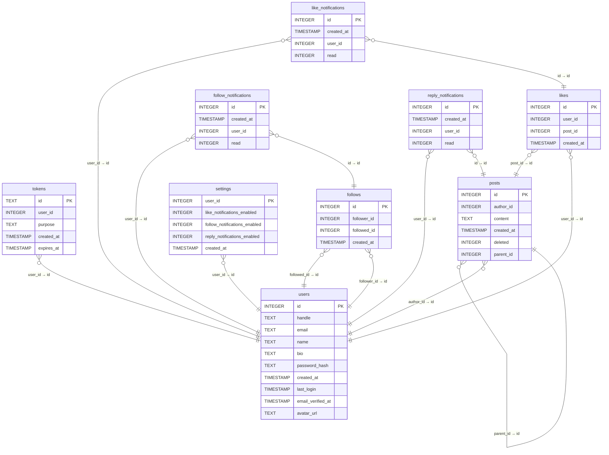

# Database Diagram

```mermaid
erDiagram
  users {
    INTEGER id PK
    TEXT handle
    TEXT email
    TEXT name
    TEXT bio
    TEXT password_hash
    TIMESTAMP created_at
    TIMESTAMP last_login
    TIMESTAMP email_verified_at
    TEXT avatar_url
  }
  tokens {
    TEXT id PK
    INTEGER user_id
    TEXT purpose
    TIMESTAMP created_at
    TIMESTAMP expires_at
  }
  follows {
    INTEGER id PK
    INTEGER follower_id
    INTEGER followed_id
    TIMESTAMP created_at
  }
  posts {
    INTEGER id PK
    INTEGER author_id
    TEXT content
    TIMESTAMP created_at
    INTEGER deleted
    INTEGER parent_id
  }
  likes {
    INTEGER id PK
    INTEGER user_id
    INTEGER post_id
    TIMESTAMP created_at
  }
  follow_notifications {
    INTEGER id PK
    TIMESTAMP created_at
    INTEGER user_id
    INTEGER read
  }
  like_notifications {
    INTEGER id PK
    TIMESTAMP created_at
    INTEGER user_id
    INTEGER read
  }
  reply_notifications {
    INTEGER id PK
    TIMESTAMP created_at
    INTEGER user_id
    INTEGER read
  }
  settings {
    INTEGER user_id PK
    INTEGER like_notifications_enabled
    INTEGER follow_notifications_enabled
    INTEGER reply_notifications_enabled
    TIMESTAMP created_at
  }
  tokens }o--|| users : "user_id → id"
  follows }o--|| users : "followed_id → id"
  follows }o--|| users : "follower_id → id"
  posts }o--|| posts : "parent_id → id"
  posts }o--|| users : "author_id → id"
  likes }o--|| posts : "post_id → id"
  likes }o--|| users : "user_id → id"
  follow_notifications }o--|| users : "user_id → id"
  follow_notifications }o--|| follows : "id → id"
  like_notifications }o--|| users : "user_id → id"
  like_notifications }o--|| likes : "id → id"
  reply_notifications }o--|| users : "user_id → id"
  reply_notifications }o--|| posts : "id → id"
  settings }o--|| users : "user_id → id"
```